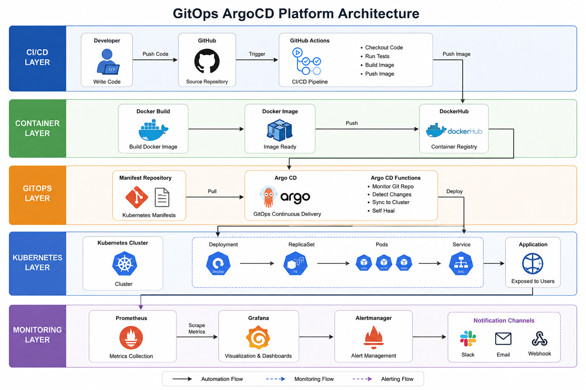

# GitOps ArgoCD Platform

Production-grade GitOps Kubernetes platform implementing CI/CD automation, ArgoCD-based GitOps deployment, and Prometheus-Grafana monitoring stack.

---

# Architecture Diagram



---

# Tech Stack

| Category | Tools |
|---|---|
| CI/CD | GitHub Actions |
| Containerization | Docker |
| Orchestration | Kubernetes |
| GitOps | ArgoCD |
| Monitoring | Prometheus |
| Visualization | Grafana |
| Alerting | Alertmanager |
| Package Management | Helm |

---

# Features

- CI/CD Automation
- GitOps Deployment
- Kubernetes Orchestration
- Monitoring and Observability
- Automated Rollouts
- Self-Healing Infrastructure
- Prometheus Metrics Collection
- Grafana Dashboards
- Alert Management

---

# Project Workflow

## CI/CD Workflow

1. Developer pushes code to GitHub
2. GitHub Actions pipeline triggers automatically
3. Docker image is built
4. Docker image pushed to DockerHub

---

## GitOps Workflow

1. Kubernetes manifests stored in Git repository
2. ArgoCD monitors manifest repository
3. ArgoCD detects Git changes
4. Cluster state synchronized automatically
5. Kubernetes deployment updated

---

## Monitoring Workflow

1. Prometheus scrapes Kubernetes metrics
2. Grafana visualizes metrics using dashboards
3. Alertmanager manages alerts and notifications

---

# Kubernetes Resources Used

- Deployment
- Service
- ReplicaSet
- Pods
- Namespace

---

# Monitoring Components

| Component | Purpose |
|---|---|
| Prometheus | Metrics collection |
| Grafana | Metrics visualization |
| Alertmanager | Alert routing and management |
| Node Exporter | Node-level metrics |
| kube-state-metrics | Kubernetes object metrics |

---

# Screenshots

## ArgoCD Sync Status


---

## Grafana Dashboard


---

## Kubernetes Pods


---

## GitHub Actions Pipeline


---

# Troubleshooting

## ImagePullBackOff

### Cause
Incorrect Docker image reference.

### Solution
Updated deployment.yaml with correct DockerHub image path.

---

## CrashLoopBackOff

### Cause
Flask application binding issue.

### Solution
Updated Flask app to bind using:

```python
app.run(host='0.0.0.0')
